# AfriTalent
AfriTalent est une plateforme web de mise en relation entre freelances africains et entreprises à la recherche de talents.

##  Contexte du projet
Ce projet a été réalisé dans le cadre d’un exercice académique permettant de demontrer notre maitrise.
Il a pour but la creation d'un site vitrine nommé AfriTalent.

## DESIGN & INSPIRATIONS
-Choix de la palette de couleurs :
Le design d'AfriTalent repose sur une alliance de tons bleu nuit et bleu clair. Ces couleurs ont été choisies pour leur aspect professionnel et élégant, idéal pour une plateforme de mise en relation de freelances. Le bleu foncé est une teinte que j'apprécie particulièrement pour son sérieux et sa modernité, que l'on retrouve dans de nombreux sites technologiques de référence.

Pour garantir une expérience utilisateur optimale, j'ai conçu le site avec une structure flexible :
*En mode clair : Un fond épuré avec des contrastes travaillés pour assurer une excellente lisibilité.
*En mode sombre : Une transition vers des tons bleu nuit, permettant aux éléments clés de ressortir naturellement tout en offrant une interface plus reposante.
Mon approche a été de rester sobre et professionnel ; il était essentiel pour moi d'éviter les couleurs trop "flashy" afin de conserver une identité visuelle digne d'un espace de travail sérieux.
-Inspirations :
La principale source d'inspiration pour le style visuel et l'interactivité (notamment l'utilisation de compteurs animés) est le site CyberWarGame. J'ai également étudié l'ergonomie de plateformes de freelances établies comme IWORKS pour comprendre comment structurer efficacement les informations et guider l'utilisateur.
-Sources des visuels :
Les photographies illustrant le site proviennent majoritairement de Unsplash, une ressource indispensable pour des images de haute qualité.
Pour certains visuels spécifiques (avatars, images), j'ai effectué des recherches ciblées via Google Images afin de compléter les besoins du projet.

## Aperçu du projet:

 Mode clair
Partie Acceuil:
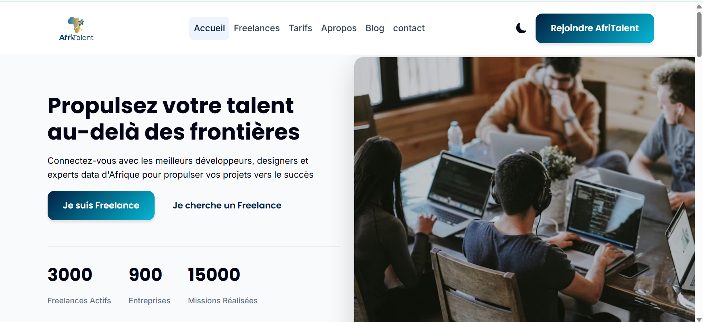
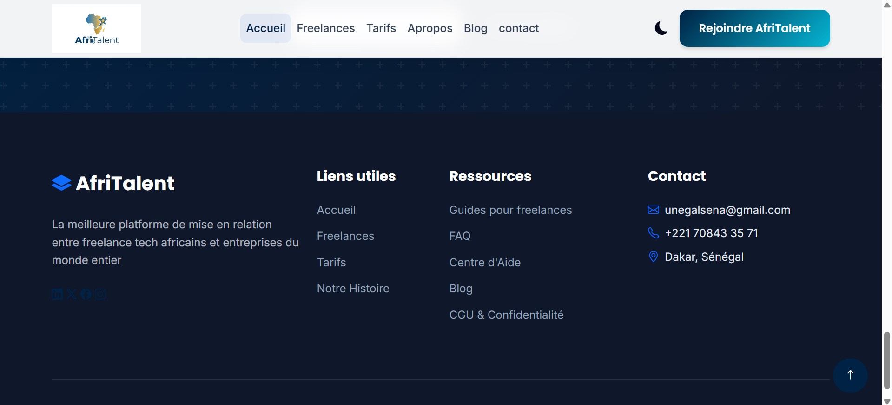
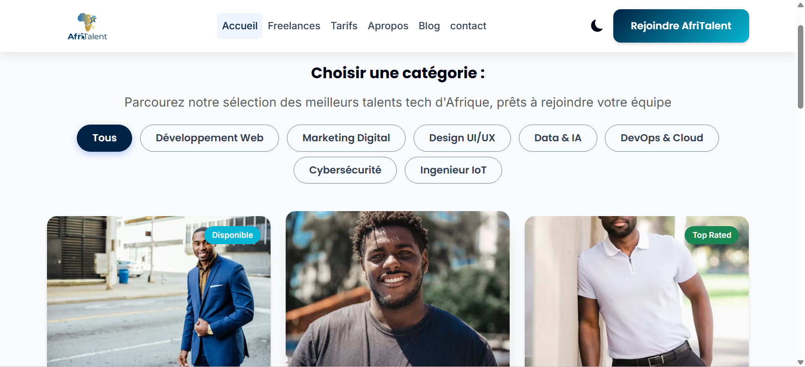
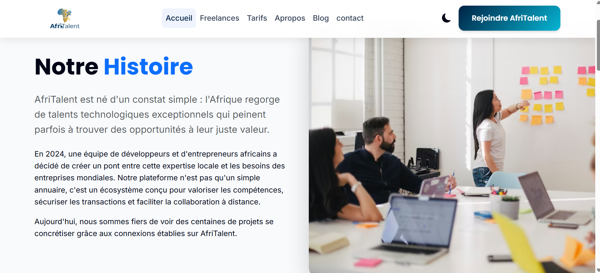
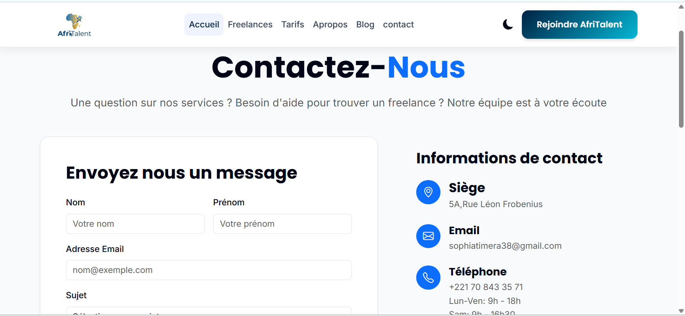
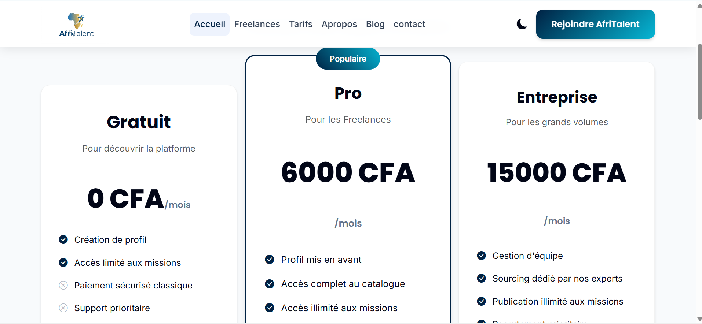
---

 Mode sombre

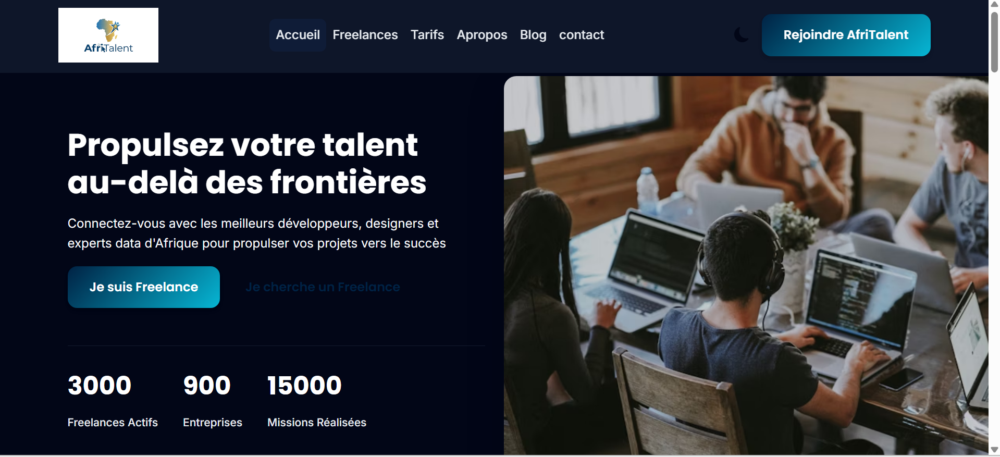
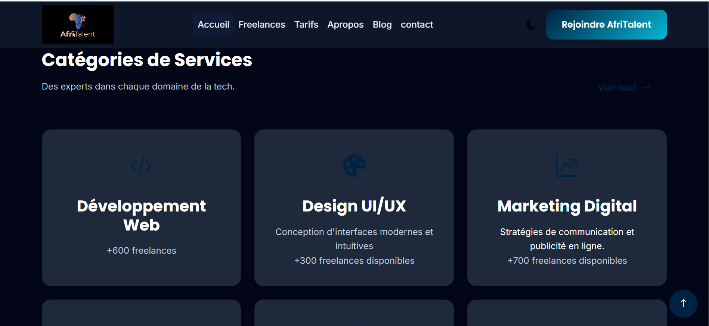
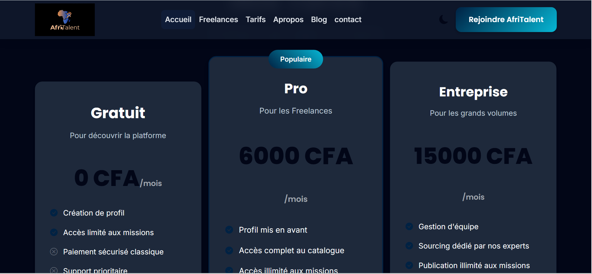
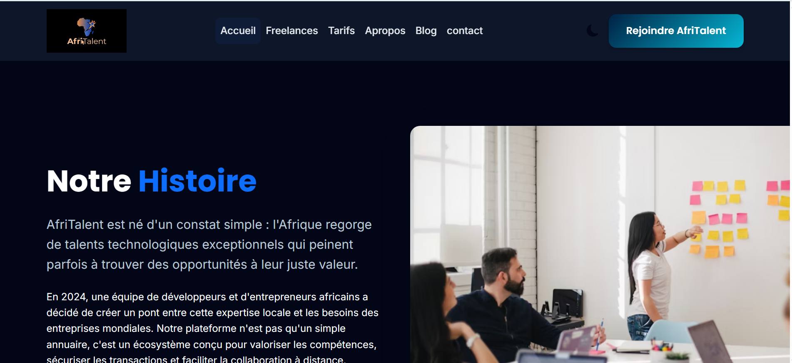
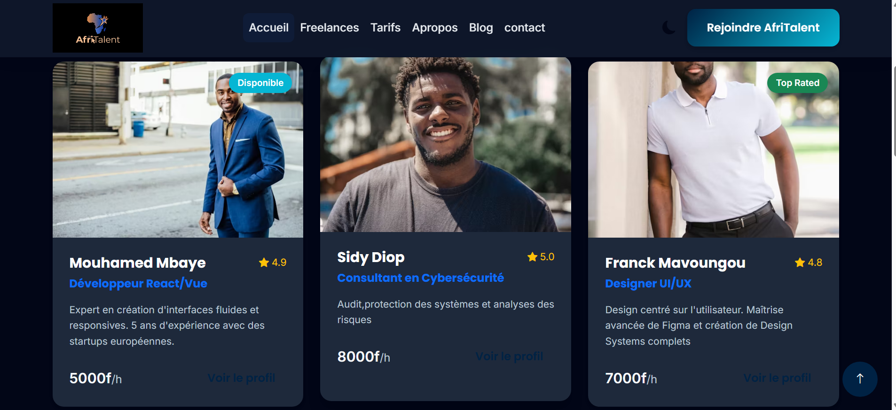

## Technologies utilisées
- HTML5
- CSS3
- JavaScript
- Bootstrap 5
- Bootstrap Icons
- Git & GitHub

## Démo du projet
Lien du site : https://sophiesticated221.github.io/TIMERA-OUMOULKHAIRI-AfriTalent/

## Fonctionnalités

- Interface moderne et responsive (mobile, tablette, desktop)
- Mode clair / mode sombre avec sauvegarde du thème
- Section tarifs claire et structurée
- FAQ interactive avec accordéon Bootstrap
- Animations au scroll (fade-in)
- Compteurs animés pour statistiques
- Filtrage dynamique des freelances
- Expérience utilisateur fluide et intuitive

## Démarche de développement

Le projet a été construit progressivement en plusieurs étapes :

1. création du dépôt, arborescence des fichiers et structure HTML de base 
2. structure complète des 5 pages du site avec sections et contenu 
3. Création de la navigation et du footer
4. Développement des sections principales (Accueil, Tarifs, FAQ)
5. Design avec CSS et Bootstrap
   - Variables
   - Typographhie
   - Style de base
   - Bento Grid
   - Effet hover
6. Ajout des interactions JavaScript :
   - Mode sombre
   - FAQ accordéon
   - Animations au scroll
   - Composants dynamiques
7. Tests et correction des bugs
8. Optimisation et finalisation du projet

---

## Organisation des commits

Le projet respecte une contrainte de 10 commits maximum, chacun ayant un objectif précis :

1. Création du dépôt, arborescence des fichiers et structure HTML de base 
2. HTML: HTML : structure complète des 5 pages avec sections et contenu texte 
3. CSS : variables, typographie, layout général et styles de base
4. CSS : Bento Grid, sections hero et catégories, effets hover 
5. CSS : responsive design mobile et tablette, media queries 
6. JS : dark mode avec localStorage, navbar dynamique au scroll
7. JS : compteurs animés au scroll et animations fade-in des sections 
8. JS : filtrage dynamique des freelances et validation du formulaire de contact
9. Finalisation : corrections responsive, optimisation du code et commentaires
10. Déploiement : GitHub Pages activé, README finalisé et présentation PowerPoint ajoutée

## Technologies utilisées

- HTML5
- CSS3
- Bootstrap 5
- JavaScript
- Bootstrap Icons

##  Objectif du projet

Ce projet a été réalisé dans un objectif d’apprentissage et de maîtrise des bases du développement front-end, notamment :

- Structuration d’une page web complète
- Utilisation de Bootstrap
- Manipulation du DOM en JavaScript
- Gestion d’interactions utilisateur
- Déploiement avec GitHub Pages
